# 🚀 Lab 3.3 - Multi-Agent Jenkins Pipeline (Distributed Builds)

<div align="center">


</div>

---

## 📌 Overview

In previous labs, builds executed on a single agent.

In this lab, I built a **distributed Jenkins pipeline** where different stages execute on different agents based on their responsibilities.

The pipeline uses:

* A Linux static agent for build preparation and archival
* An ephemeral Docker agent for validation and testing
* Artifact transfer using Jenkins `stash` and `unstash`
* Controller-safe execution using `agent none`

This simulates how modern enterprise Jenkins environments distribute workloads across specialized execution nodes.

---

## 🎯 Learning Objectives

By completing this lab, I learned how to:

✅ Use multiple agents within a single pipeline  
✅ Route stages to specific agents using labels  
✅ Use `agent none` for controller-safe execution  
✅ Transfer files between agents using `stash` and `unstash`  
✅ Understand workspace isolation across agents  
✅ Execute tests inside ephemeral Docker containers  
✅ Publish JUnit reports from distributed builds  
✅ Troubleshoot agent scheduling issues  
✅ Understand how large Jenkins environments scale build execution  

---

## 🧠 Core Concept — Distributed Build Execution

A Jenkins Controller should coordinate work.

It should not perform work.

Modern Jenkins environments distribute execution across multiple agents.

```text
                         Jenkins Controller
                                 │
                                 │
                          Schedules Work
                                 │
          ┌──────────────────────┼──────────────────────┐
          │                                              │
          ▼                                              ▼

    Linux Static Agent                         Docker Agent
    (Persistent Node)                     (Ephemeral Container)

    Checkout Code                         Validate Artifact
    Create Artifact                       Run Tests
    Stash Files                           Generate Reports

          │                                              │
          └─────────────── Artifact Transfer ────────────┘
```

---

## 🏗️ Architecture Overview

```text
┌─────────────────────────────────────────────┐
│              Jenkins Controller             │
│                                             │
│  Reads Jenkinsfile                          │
│  Schedules Stages                           │
│  Transfers Stashed Artifacts                │
│  Publishes Reports                          │
│                                             │
│  Does NOT execute build logic               │
└─────────────────┬───────────────────────────┘
                  │
                  │
    ┌─────────────┴─────────────┐
    │                           │
    ▼                           ▼

┌──────────────────┐   ┌──────────────────────┐
│   Linux Agent    │   │    Docker Agent      │
│ label:           │   │ python:3.11-slim     │
│ linux-agent      │   │                      │
│                  │   │                      │
│ Checkout         │   │ Unstash Artifact     │
│ Create Artifact  │   │ Run pytest           │
│ Stash Artifact   │   │ Generate JUnit XML   │
└──────────────────┘   └──────────────────────┘
```

---

## 🧪 QA → DevOps Mapping

| QA Mindset               | DevOps Equivalent              |
| ------------------------ | ------------------------------ |
| Selenium Grid Hub        | Jenkins Controller             |
| Selenium Grid Node       | Jenkins Agent                  |
| Test Environment Routing | Agent Labels                   |
| Test Artifact Sharing    | stash/unstash                  |
| Parallel Test Execution  | Distributed Pipeline Execution |
| Fresh Browser Session    | Ephemeral Docker Agent         |
| Test Report Collection   | JUnit Publishing               |

---

## ⚙️ Tech Stack Used

| Tool        | Purpose                    |
| ----------- | -------------------------- |
| Jenkins     | CI/CD Orchestration        |
| Linux Agent | Static Build Node          |
| Docker      | Ephemeral Test Environment |
| Python 3.11 | Runtime Environment        |
| pytest      | Validation Framework       |
| JUnit XML   | Jenkins Reporting          |
| Git         | Source Control             |

---

## 📂 Project Structure

```text
lab-3.3-multi-agent-pipeline/
├── README.md                          # Main documentation
├── Jenkinsfile                        # Pipeline definition
├── break-it-exercises.md              # Break-it exercises documentation
│
├── tests/
│   └── test_artifact.py               # Pytest validation
│
└── screenshots/
    ├── 01-successful-build-artifacts-archived.png
    ├── 02-successful-multi-agent-pipeline-build.png
    ├── 03-linux-agent-build-stage-execution.png
    ├── 04-docker-agent-validation-stage-execution.png
    ├── 05-stash-artifact-on-linux-agent.png
    ├── 06-unstash-artifact-on-docker-agent.png
    ├── 07-junit-test-results-published.png
    ├── 08-break-it-1-missing-stash-build-failure.png
    ├── 09-break-it-1-stash-error-message.png
    ├── 10-break-it-2-invalid-agent-label-queued.png
    ├── 11-break-it-2-fixed-correct-label-success.png
    └── 12-break-it-3-agent-any-controller-execution.png
```

---

## 🔄 Pipeline Flow

```text
Stage 1: Build Artifact - Linux Agent
│
├── Checkout Code
├── Create Artifact (build/app.txt)
└── Stash Artifact
          │
          ▼
Stage 2: Validate Artifact - Docker Agent
│
├── Unstash Artifact
├── Validate Artifact Exists
├── Install pytest
├── Run Tests
├── Generate JUnit XML
└── Stash Test Results
          │
          ▼
Stage 3: Archive Results - Linux Agent
│
├── Unstash Test Results
├── Verify Results Received
└── List Results Directory
          │
          ▼
Post Actions (Linux Agent)
│
├── Publish JUnit Reports
└── Archive Build Artifacts
```

---

## 🏆 Final Working Jenkinsfile

```groovy
pipeline {

    agent none

    options {
        buildDiscarder(logRotator(numToKeepStr: '5'))
        timeout(time: 15, unit: 'MINUTES')
    }

    stages {

        stage('Build Artifact - Linux Agent') {

            agent {
                label 'linux-agent'
            }

            steps {

                echo "Running on Linux Agent"

                sh '''
                    mkdir -p build

                    echo "Application Build Artifact" > build/app.txt

                    echo "Hostname: $(hostname)"
                    echo "Node Name: ${NODE_NAME}"

                    cat build/app.txt
                '''

               stash(
    			name: 'build-artifact',
    			includes: 'build/**'
		)
            }
        }

        stage('Validate Artifact - Docker Agent') {

            agent {
                docker {
                    image 'python:3.11-slim'
                    reuseNode true
                }
            }

            steps {

                unstash 'build-artifact'

                sh '''
                    mkdir -p results

                    echo "Docker Hostname: $(hostname)"
                    echo "Docker User: $(whoami)"
                    echo "Node Name: ${NODE_NAME}"

                    pip install --target=/tmp/.local pytest

                    export PATH=/tmp/.local/bin:$PATH
                    export PYTHONPATH=/tmp/.local:$PYTHONPATH

                    echo "Build directory contents:"
                    ls -la build/

                    echo "Artifact content:"
                    cat build/app.txt
                '''

                sh '''
                    export PATH=/tmp/.local/bin:$PATH
                    export PYTHONPATH=/tmp/.local:$PYTHONPATH

                    pytest tests/test_artifact.py \
                      --junit-xml=results/test-results.xml \
                      -v
                '''

                sh '''
                    echo "JUnit files:"
                    ls -la results/
                '''

                stash(
                    name: 'test-results',
                    includes: 'results/**'
                )
            }
        }

        stage('Archive Results - Linux Agent') {

            agent {
                label 'linux-agent'
            }

            steps {

                unstash 'test-results'

                sh '''
                    echo "Results received from Docker Agent"

                    ls -la results/
                '''
            }
        }
    }

    post {

        always {

            node('linux-agent') {

                script {

                    try {
                        unstash 'test-results'

                        junit 'results/test-results.xml'
                    } catch (Exception e) {
                        echo "No test results to publish: ${e.message}"
                    }

                    try {
                        unstash 'build-artifact'

                        archiveArtifacts(
                            artifacts: 'build/**',
                            fingerprint: true
                        )
                    } catch (Exception e) {
                        echo "No build artifacts to archive: ${e.message}"
                    }
                }
            }
        }

        success {
            echo 'SUCCESS - Multi-Agent Pipeline Completed'
        }

        failure {
            echo 'FAILURE - Check Pipeline Logs'
        }
    }
}
```

---

## 🔥 Key Features Implemented

✅ Controller-safe execution with `agent none`  
✅ Linux static agent execution  
✅ Docker ephemeral agent execution  
✅ Stage-level agent routing  
✅ Artifact transfer using `stash`  
✅ Artifact retrieval using `unstash`  
✅ Pytest validation in Docker container  
✅ JUnit test reporting  
✅ Build artifact archival  
✅ Build retention policy  
✅ Pipeline timeout protection  
✅ Distributed build architecture  
✅ Error handling with try-catch blocks  

---

## 📸 Build Execution Screenshots

### Successful Multi-Agent Pipeline Build

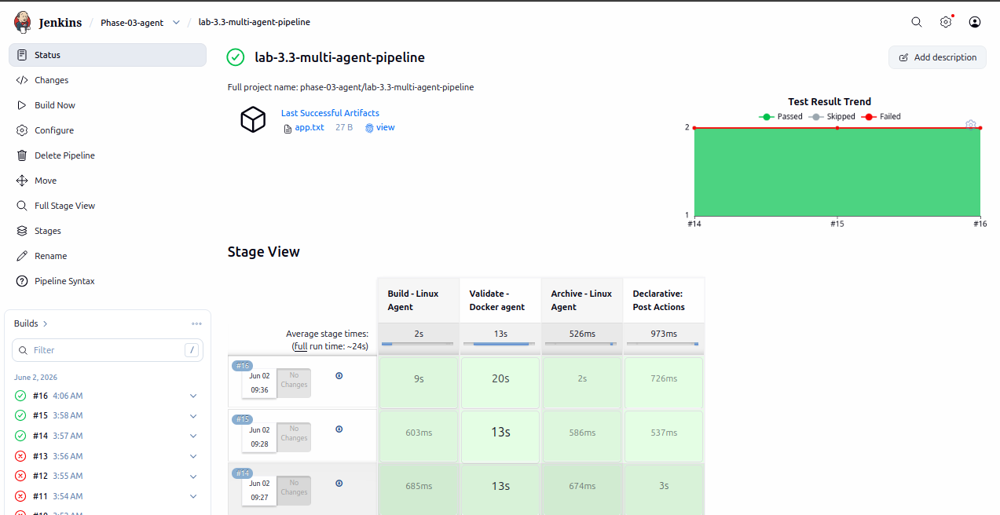

The pipeline successfully executed across two different agents with proper artifact transfer and test reporting.

---

### Stage 1: Linux Agent - Build Artifact

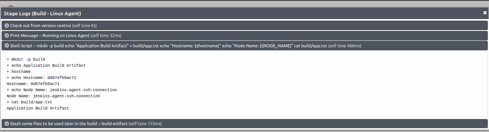

The Linux agent creates the build artifact and displays system information to verify execution on the correct node.

---

### Stage 2: Docker Agent - Validation

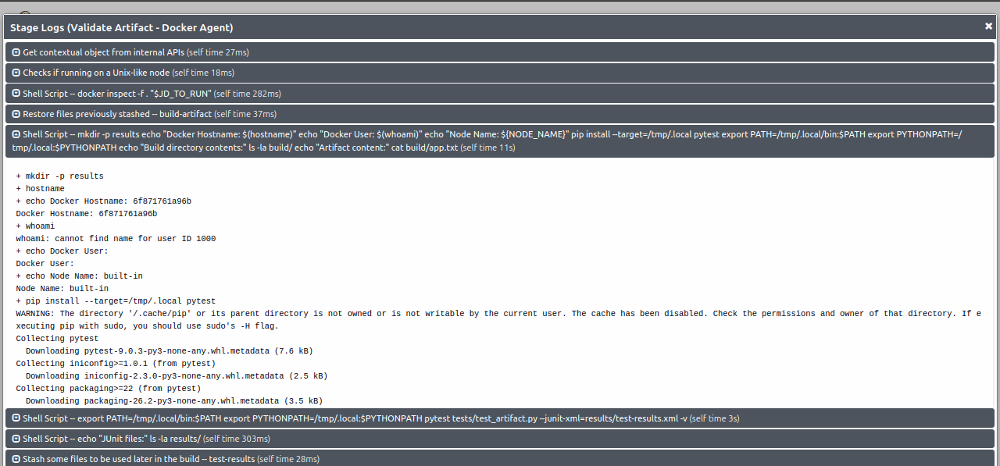

The Docker agent runs pytest validation inside a Python 3.11 container, demonstrating ephemeral agent usage.

---

### Artifact Transfer: Stash on Linux Agent


The `stash` command saves the build artifact to Jenkins internal storage for transfer to other agents.

---

### Artifact Transfer: Unstash on Docker Agent

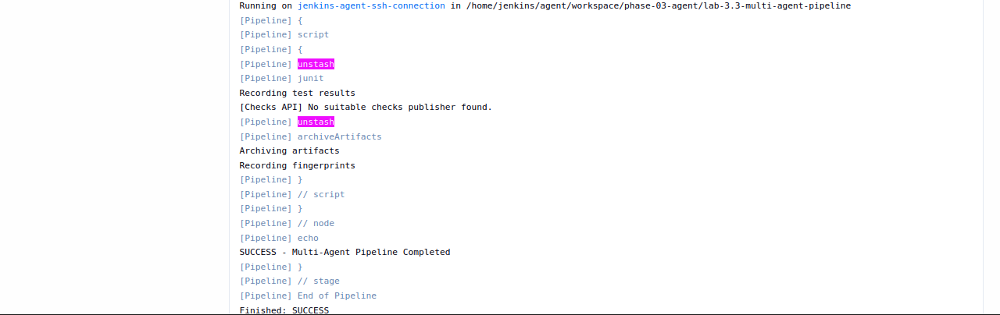

The `unstash` command retrieves the artifact from Jenkins storage into the Docker agent's workspace.

---

### JUnit Test Results

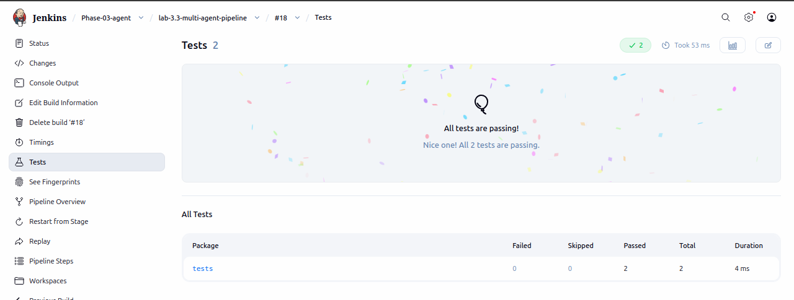

Jenkins publishes the JUnit test results, showing test execution status and trends.

---

### Artifacts Archived

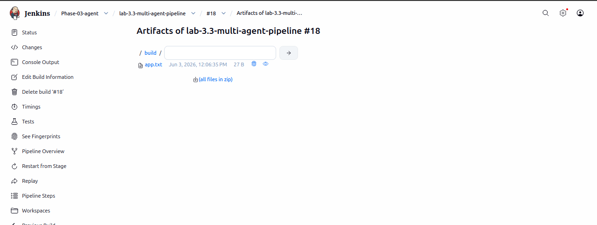

Build artifacts are archived and available for download with fingerprinting enabled.

---

## 💥 Break-It Exercises Completed

I performed three break-it exercises to deeply understand multi-agent pipelines. Full documentation available in [break-it-exercises.md](break-it-exercises.md).

---

### ❌ Exercise 1 — Missing Stash

**What I Changed:** Removed the `stash` step

**What Happened:** `ERROR: No such saved stash 'build-artifact'`

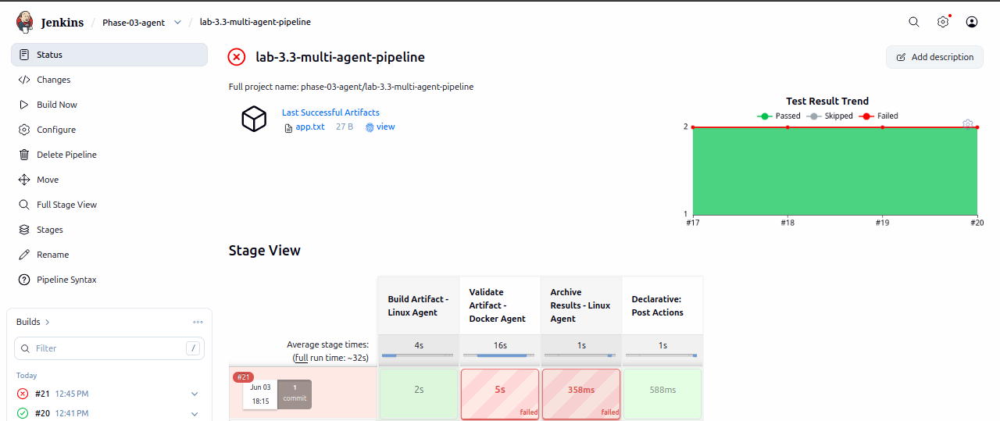

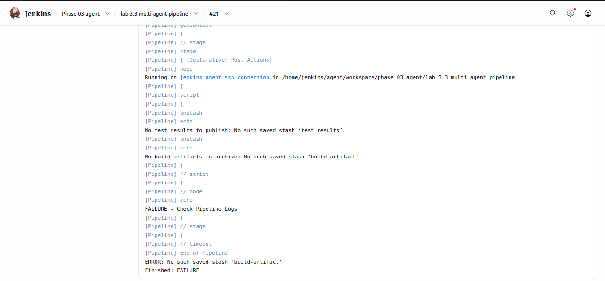

**Key Learning:** Agents do not share workspaces automatically. Artifact transfer requires `stash`/`unstash`.

---

### ❌ Exercise 2 — Wrong Agent Label

**What I Changed:** Changed `label 'linux-agent'` to `label 'invalid-agent'`

**What Happened:** Pipeline remained queued indefinitely

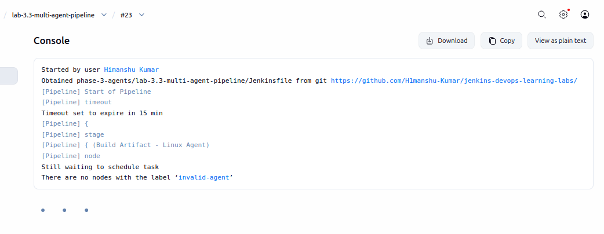

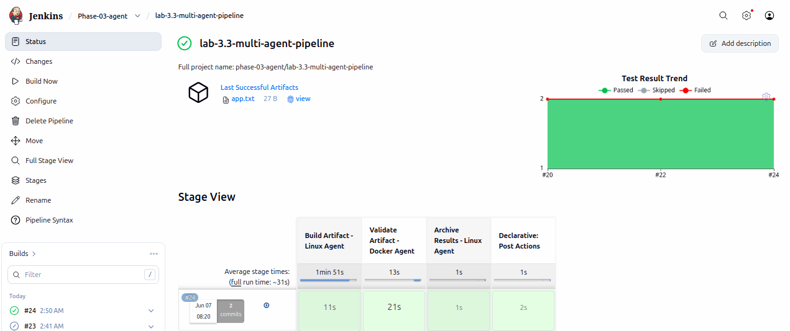

**Key Learning:** Agent labels must match available nodes. Incorrect labels cause pipeline starvation.

---

### ❌ Exercise 3 — Agent Any vs Agent None

**What I Changed:** Changed `agent none` to `agent any`

**What Happened:** Pipeline allocated a global workspace unnecessarily, potentially executing on Controller

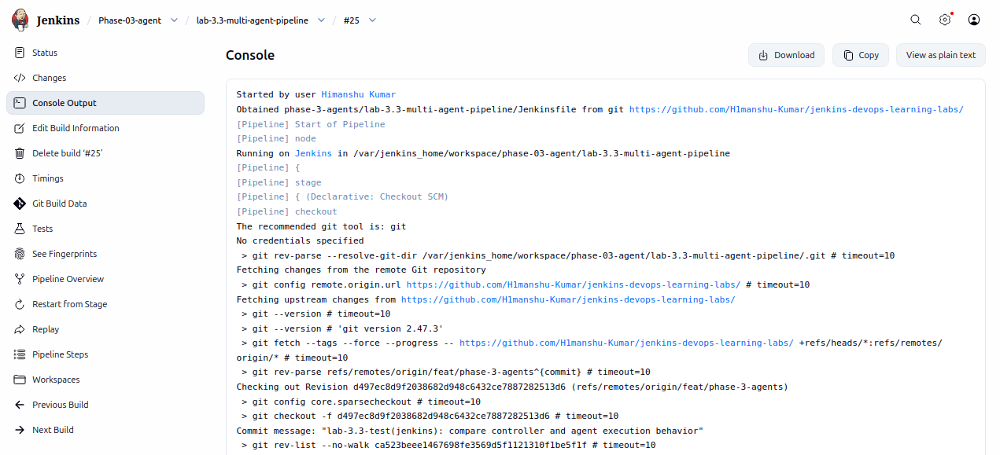

**Key Learning:** Use `agent none` to prevent Controller execution and enforce explicit agent assignment per stage.

---

## 🧩 Problems Faced & Solutions

| Problem | Root Cause | Solution |
|---------|------------|----------|
| Artifact missing in Docker stage | Workspace isolation between agents | Implemented `stash`/`unstash` |
| Pipeline stuck in queue | Incorrect agent label | Corrected label to match available node |
| pytest not found in PATH | Docker container PATH configuration | Exported PATH with pip install location |
| JUnit report not published | Wrong file path in post section | Corrected path to `results/test-results.xml` |
| Build executed on Controller | Used `agent any` instead of `agent none` | Changed to `agent none` at pipeline level |
| Post section failed without workspace | No workspace available in post block | Wrapped post actions in `node('linux-agent')` |

---

## 📊 Build Verification Checklist

Successfully verified:

✅ Linux Agent execution  
✅ Docker Agent execution  
✅ Artifact creation (`build/app.txt`)  
✅ Artifact stashing on Linux Agent  
✅ Artifact unstashing on Docker Agent  
✅ Workspace isolation validation  
✅ Pytest execution in Docker  
✅ JUnit XML generation  
✅ Test results transfer  
✅ JUnit report publishing  
✅ Artifact archival  
✅ Multi-agent scheduling  
✅ Controller-safe execution with `agent none`  

---

## 🎤 Interview Talking Points

### 🔹 Why Use `agent none`?

Using:

```groovy
agent none
```

prevents accidental controller execution.

**Benefits:**
* Better scalability
* Enhanced security
* Explicit agent assignment
* Production best practice
* Resource optimization

**Without `agent none`:**
- Controller might execute build workload
- Wasted executor slots
- Security risk
- Poor scalability

---

### 🔹 What Problem Does stash/unstash Solve?

Different agents have different workspaces on different machines/containers.

Files do not automatically move between them.

**Real-World Analogy:**
- Agents = Different computers
- Workspaces = Different hard drives
- stash/unstash = File transfer system

**Example:**

```groovy
// Linux Agent
sh 'echo "data" > file.txt'
stash name: 'myfile', includes: 'file.txt'

// Docker Agent (different machine)
unstash 'myfile'  // Now file.txt is available here
sh 'cat file.txt'
```

---

### 🔹 Why Use Different Agents For Different Stages?

Different stages may require:

* **Different operating systems** (Linux vs Windows)
* **Different runtimes** (Java 8 vs Java 17)
* **Different tools** (Maven vs Gradle)
* **Different resource requirements** (CPU-intensive vs memory-intensive)
* **Ephemeral environments** (Docker containers for testing)
* **Specialized hardware** (GPU for ML, specific OS for builds)

**Benefits:**
- Better resource utilization
- Isolated environments
- Improved security
- Faster execution (parallel stages on different agents)

---

### 🔹 What Happens If No Agent Matches A Label?

Jenkins cannot schedule the build.

Pipeline remains queued until:
- A matching node becomes available, OR
- Pipeline times out, OR
- Build is manually aborted

**How to Debug:**
1. Check available agents: Manage Jenkins → Nodes
2. Verify agent labels
3. Check if agents are online
4. Review agent capacity (executors available)

---

### 🔹 Why Is This Important In Real DevOps?

This architecture is commonly used in:

* **Enterprise Jenkins installations** - Hundreds of pipelines, dedicated agents for different teams
* **Kubernetes Jenkins agents** - Dynamic pod creation for builds
* **Cloud-native CI/CD** - On-demand agent provisioning
* **GitHub Actions runners** - Self-hosted vs GitHub-hosted
* **GitLab runners** - Shared vs specific runners

**Real Example:**

```text
Company Pipeline:
├── Linux Agent → Backend builds (Java/Maven)
├── Windows Agent → .NET builds
├── Mac Agent → iOS builds
├── Docker Agent → Integration tests
└── GPU Agent → ML model training
```

---

## 📚 Key Learnings

This lab helped me understand:

* **Distributed build execution** - How to distribute work across multiple agents
* **Agent scheduling** - How Jenkins matches work to available nodes
* **Workspace isolation** - Why files don't automatically transfer between agents
* **Artifact movement** - How to transfer files using stash/unstash
* **Controller best practices** - Why controllers should orchestrate, not execute
* **Stage-level execution environments** - How to use different agents per stage
* **Enterprise Jenkins architecture** - How large organizations structure CI/CD

---

## 🚀 Biggest Takeaway

> **A Jenkins Controller should coordinate builds.**
>
> **Jenkins Agents should execute builds.**
>
> Multi-agent pipelines allow the right work to run in the right environment while keeping the controller lightweight, secure, and scalable.

This is the foundation of enterprise-grade Jenkins architecture.

---

## 📋 Lab Completion Checklist

### Setup
- [x] Linux agent configured and online
- [x] Docker available on agent
- [x] Agent labels properly set
- [x] `agent none` configured at pipeline level

### Pipeline Implementation
- [x] Stage-level agents configured
- [x] `stash` implemented for artifact transfer
- [x] `unstash` implemented for artifact retrieval
- [x] pytest integrated in Docker container
- [x] JUnit reporting enabled
- [x] Artifact archival configured
- [x] Error handling with try-catch

### Validation
- [x] Build artifact created successfully
- [x] Artifact transferred between agents
- [x] Tests executed in Docker
- [x] Reports published correctly
- [x] Screenshots captured for all stages

### Break-It Exercises
- [x] Exercise 1: Missing stash tested and documented
- [x] Exercise 2: Wrong agent label tested and documented
- [x] Exercise 3: `agent none` validation completed and documented

---

## 🔗 Related Labs

- **Lab 3.1** - Static Jenkins Agent Setup
- **Lab 3.2** - Docker Jenkins Agent Configuration
- **Lab 3.4** - Parallel Multi-Agent Execution (if applicable)

---

## 📖 Additional Resources

- [Jenkins Pipeline Syntax](https://www.jenkins.io/doc/book/pipeline/syntax/)
- [Using Multiple Agents](https://www.jenkins.io/doc/book/pipeline/syntax/#agent)
- [Stash and Unstash](https://www.jenkins.io/doc/pipeline/steps/workflow-basic-steps/#stash-stash-some-files-to-be-used-later-in-the-build)
- [Docker Pipeline Plugin](https://www.jenkins.io/doc/book/pipeline/docker/)
- [Distributed Builds](https://www.jenkins.io/doc/book/scaling/architecting-for-scale/)

---

## ✍️ Author

**Himanshu Kumar**

DevOps Engineer | Learning Through Building, Breaking, and Documenting

**Learning Philosophy:** "Break it to understand it, document it to master it, share it to grow together."

---

## 🏷️ Tags

`jenkins` `multi-agent` `distributed-builds` `docker` `linux-agent` `stash-unstash` `ci-cd` `devops` `pipeline-as-code` `pytest` `junit` `jenkins-controller` `agent-orchestration` `workspace-isolation` `build-automation`

---

🔥 **This lab demonstrates one of the most important concepts in Jenkins: distributed build execution using multiple agents to create scalable, maintainable, and efficient CI/CD pipelines.**

---

